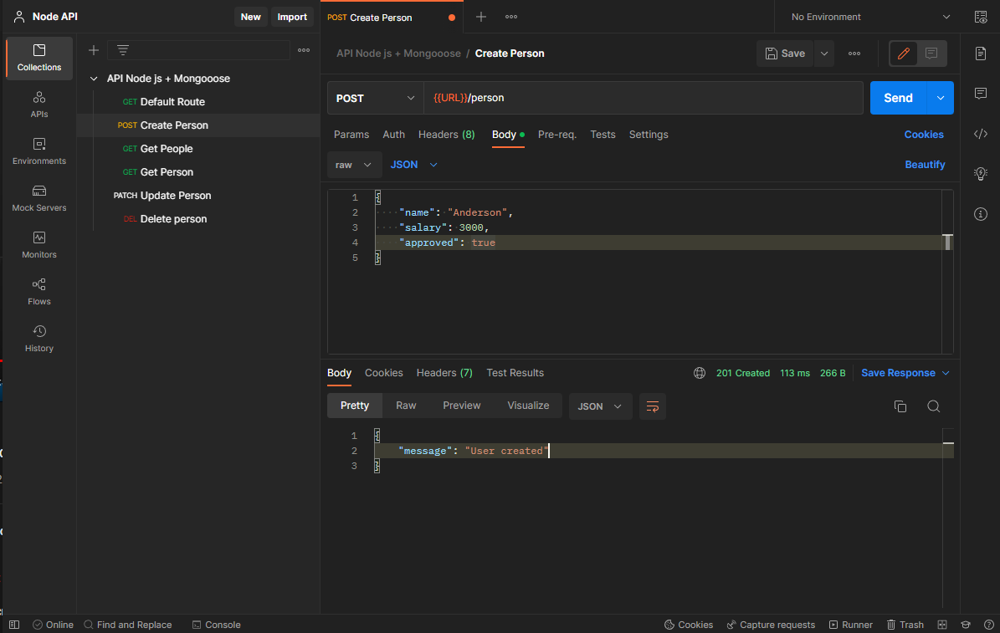
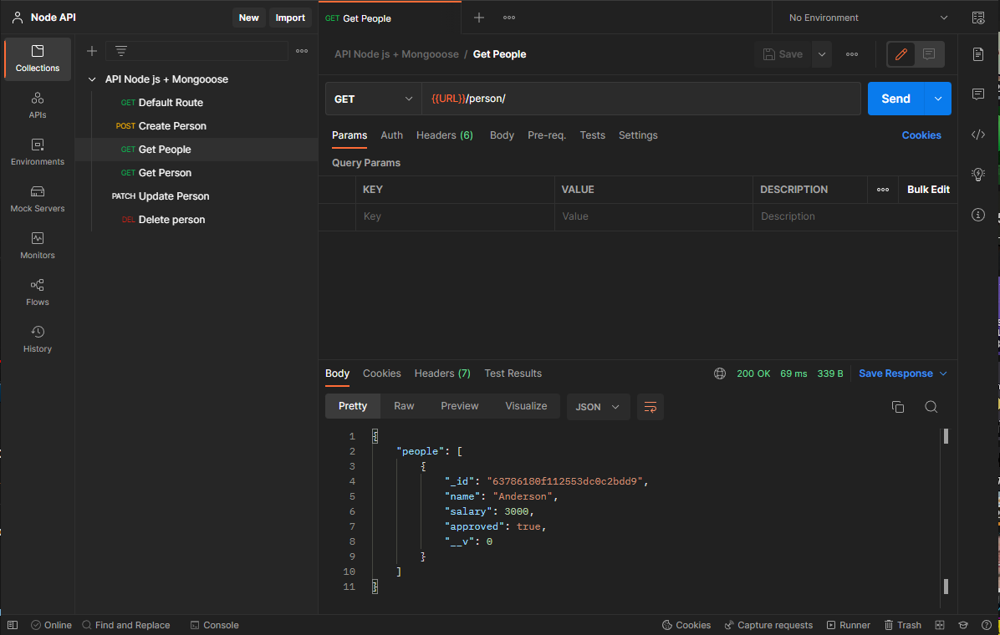
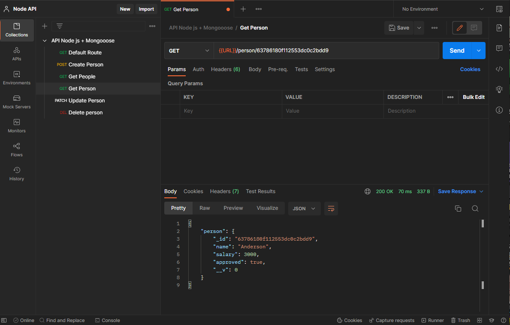
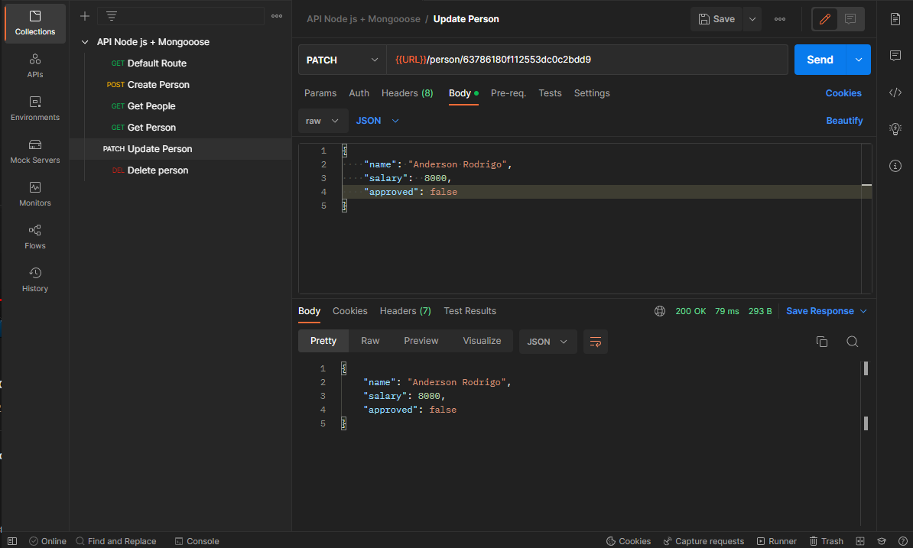
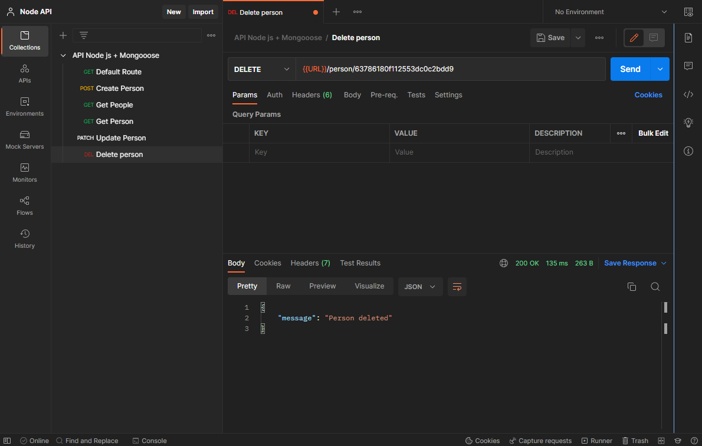

# Simple Rest API

## Table of contents

- [Overview](#overview)
  - [Screenshot](#screenshot)
  - [My process](#my-process)
  - [Built with](#built-with)
- [Author](#author)

## Overview
RESTful API with Node js for study and practice!

### Screenshot

## My process
-Setup of packages(express, nodemon and mongoose)
-Creation and setup of the index.js file
-Creation of a Database with MongoDB through MongoDB Atlas
-Build the CRUD methods and responses
-Test the API with Postman

### Built with

- Node js
- Express js
- Nodemon
- Mongoose
- MongoDB

## Author

- LinkedIn - [Anderson Melo](https://www.linkedin.com/in/anderson-melo-3aaa94198/)
- Frontend Mentor - [@Andersonrodd](https://www.frontendmentor.io/profile/Andersonrodd)
